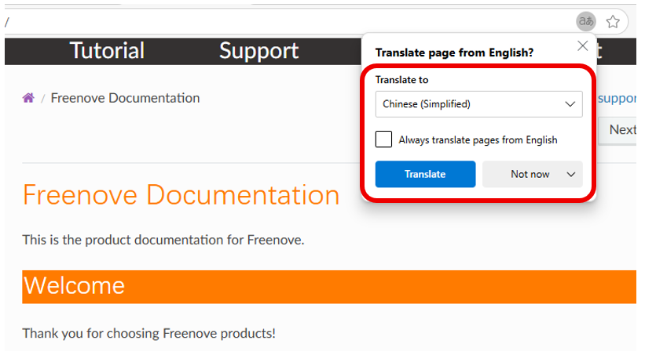

#############################################################################
How to Translate a Web Page in Most Any Browser
#############################################################################

You don't have to navigate away from a web page that displays in a language other than your own. With each of the major browsers, you can use a built-in or third-party translation tool to translate text immediately.

Here, we'll show you how to translate a web page in **Google Chrome**, **Mozilla Firefox**, **Microsoft Edge**, **Safari**, and **Opera**. For either the entire page or just a portion of it, you can read news, articles, and information in your native language or even in a language you're learning.

Table of Contents
*************************************

* :ref:`Translate a Web Page in Google Chrome <about-freenove/language:translate a web page in google chrome>`
 
  * :ref:`Translate Part of a Web Page in Chrome <about-freenove/language:translate part of a web page in chrome>`

* :ref:`Translate a Web Page in Firefox <about-freenove/language:translate a web page in firefox>`

* :ref:`Translate a Web Page in Microsoft Edge <about-freenove/language:translate a web page in microsoft edge>`

  * :ref:`Translate Part of a Web Page in Edge <about-freenove/language:translate part of a web page in edge>`

* :ref:`Translate a Web Page in Opera <about-freenove/language:translate a web page in opera>`

* :ref:`Translate a Web Page in Safari <about-freenove/language:translate a web page in safari>`

  * :ref:`Translate Part of a Web Page in Safari <about-freenove/language:translate part of a web page in safari>`

Translate a Web Page in Google Chrome
*****************************************

The Google Chrome browser offers a built-in translation tool in the form of Google Translate, making web page translations a breeze.

1. When you visit a web page where a translation is available, you'll see the Translate This Page button appear in the address bar.

  
2. Select the button and then your language to translate the page.

3. For additional tools, select the **Translate Options** button (three dots). You can then pick another language or choose to always or never translate the language or site.

Translate Part of a Web Page in Chrome
*****************************************

If you only want to translate certain text on a web page, this is another option in Google Chrome.

Select the text you want to translate by dragging your cursor through it. Then, right-click and pick **Translate selection to [default language]**.

You'll see a small window appear with the translation along with the option to translate the full page.

Translate a Web Page in Firefox
*****************************************

In the new version of Firefox browser, a built-in convenient translation tool is included to help you translate web page content.

When you visit a webpage in a language different from your default setting, the browser will display a translation icon on the right side of the address bar.

Click the icon, select the language you want to translate into, and then click **Translate** to automatically translate the page.

To view the original page again, click the translation icon and select **Show Original**.

.. image:: ../_static/images/language/language07.png
    :align: center
    :class: image-border
    :width: 80%

Translate a Web Page in Microsoft Edge
************************************************

Like Google Chrome, Microsoft Edge provides a built-in translation tool using Microsoft Translator which is similar to Google Translate.

1. Open the Settings.

2. Choose **Languages** on the left of the subsequent screen and turn on the toggle for **Offer to translate pages that aren't in a language I read**. Note that you can add and reorder your preferred languages directly above the toggle.

  
3. When you land on a web page where a translation is available, you'll see the Show Translate Options button appear in the address bar.

4. Change your default language if necessary and pick **Translate**.

5. You can also choose additional translation options.

  
Translate Part of a Web Page in Edge
*************************************************

With the built-in translator in Edge, you can also translate part of a web page.

Select the text you want to translate, right-click, and choose **Translate selection to [default language]**.

You'll then see that portion of the web page update, rather than a separate pop-up window, to display the translation.

Translate a Web Page in Opera
*************************************************

In the new version of Opera browser, a built-in convenient translation tool is included to help you translate web page content.

The browser will display a translation icon on the right side of the address bar.

Click the icon, select the language you want to translate into, and then click **Translate** to automatically translate the page.

To view the original page again, click the translation icon and select **Show Original**.

Translate a Web Page in Safari
****************************************

The Safari browser comes with a built-in translation tool, making it easy for you to translate web content.

1. To see if a translation is available for a website you're visiting, hover your cursor over the Translate icon in the address bar. If applicable, you'll see **"Translation Available"** appear.

  
2. Select the Translate icon and choose the translation language from your list of preferred options and you'll then see the page update for you.

  
3. Select the Translate button to change the languages in your list and pick Preferred Languages.

  
4. Then, use the plus sign button at the bottom of the Preferred Languages list to add another or the minus sign button to remove one.

Translate Part of a Web Page in Safari
=========================================

Like the browsers above, you can translate a portion of a web page in Safari as well.

Select the text, right-click, and choose **Translate "[selected text]."**

