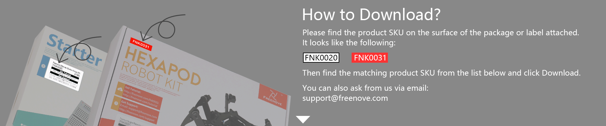

Tutorial
================================================================

.. container:: centered
            
    **Need help? Contact** support@freenove.com

.. list-table:: 
    :align: center

    * - .. centered:: SKU	
      - .. centered:: Product Name	
      - .. centered:: View on GitHub	
      - .. centered:: Download ZIP
      - .. centered:: Online

    * - .. centered:: FNK0001	
      - **Freenove Starter Kit**	
      - .. centered:: `View <https://github.com/Freenove/Freenove_Starter_Kit>`__	
      - .. centered:: `Download <https://github.com/Freenove/Freenove_Starter_Kit/archive/master.zip>`__
      -

    * - .. centered:: FNK0002	
      - **Freenove Modular Starter Kit**	
      - .. centered:: `View <https://github.com/Freenove/Freenove_Modular_Starter_Kit>`__	
      - .. centered:: `Download <https://github.com/Freenove/Freenove_Modular_Starter_Kit/archive/master.zip>`__
      -

    * - .. centered:: FNK0003	
      - **Freenove Three-wheeled Smart Car Kit**	
      - .. centered:: `View <https://github.com/Freenove/Freenove_Three-wheeled_Smart_Car_Kit>`__	
      - .. centered:: `Download <https://github.com/Freenove/Freenove_Three-wheeled_Smart_Car_Kit/archive/master.zip>`__
      -

    * - .. centered:: FNK0004	
      - **Freenove Starter Kit without Control Board**	
      - .. centered:: `View <https://github.com/Freenove/Freenove_Starter_Kit>`__	
      - .. centered:: `Download <https://github.com/Freenove/Freenove_Starter_Kit/archive/master.zip>`__
      -

    * - .. centered:: FNK0005	
      - **Freenove Super Starter Kit**	
      - .. centered:: `View <https://github.com/Freenove/Freenove_Super_Starter_Kit>`__	
      - .. centered:: `Download <https://github.com/Freenove/Freenove_Super_Starter_Kit/archive/master.zip>`__
      -

    * - .. centered:: FNK0006	
      - **Freenove Super Starter Kit without Control Board**	
      - .. centered:: `View <https://github.com/Freenove/Freenove_Super_Starter_Kit>`__	
      - .. centered:: `Download <https://github.com/Freenove/Freenove_Super_Starter_Kit/archive/master.zip>`__
      -

    * - .. centered:: FNK0007	
      - **Freenove Basic Starter Kit**	
      - .. centered:: `View <https://github.com/Freenove/Freenove_Basic_Starter_Kit>`__	
      - .. centered:: `Download <https://github.com/Freenove/Freenove_Basic_Starter_Kit/archive/master.zip>`__
      -

    * - .. centered:: FNK0008	
      - **Freenove Basic Starter Kit without Control Board**	
      - .. centered:: `View <https://github.com/Freenove/Freenove_Basic_Starter_Kit>`__	
      - .. centered:: `Download <https://github.com/Freenove/Freenove_Basic_Starter_Kit/archive/master.zip>`__
      - 

    * - .. centered:: FNK0009	
      - **Freenove LCD1602 Starter Kit**	
      - .. centered:: `View <https://github.com/Freenove/Freenove_LCD1602_Starter_Kit>`__	
      - .. centered:: `Download <https://github.com/Freenove/Freenove_LCD1602_Starter_Kit/archive/master.zip>`__
      -

    * - .. centered:: FNK0010	
      - **Freenove LCD1602 Starter Kit without Control Board**	
      - .. centered:: `View <https://github.com/Freenove/Freenove_LCD1602_Starter_Kit>`__	
      - .. centered:: `Download <https://github.com/Freenove/Freenove_LCD1602_Starter_Kit/archive/master.zip>`__
      - 

    * - .. centered:: FNK0011	
      - **Freenove Ultrasonic Starter Kit**	
      - .. centered:: `View <https://github.com/Freenove/Freenove_Ultrasonic_Starter_Kit>`__	
      - .. centered:: `Download <https://github.com/Freenove/Freenove_Ultrasonic_Starter_Kit/archive/master.zip>`__
      - 

    * - .. centered:: FNK0012	
      - **Freenove Ultrasonic Starter Kit without Control Board**	
      - .. centered:: `View <https://github.com/Freenove/Freenove_Ultrasonic_Starter_Kit>`__	
      - .. centered:: `Download <https://github.com/Freenove/Freenove_Ultrasonic_Starter_Kit/archive/master.zip>`__
      - 

    * - .. centered:: FNK0013	
      - **Freenove RFID Kit**	
      - .. centered:: `View <https://github.com/Freenove/Freenove_RFID_Kit>`__	
      - .. centered:: `Download <https://github.com/Freenove/Freenove_RFID_Kit/archive/master.zip>`__
      - 

    * - .. centered:: FNK0014	
      - **Freenove Modular Starter Kit without Control Board**	
      - .. centered:: `View <https://github.com/Freenove/Freenove_Modular_Starter_Kit>`__	
      - .. centered:: `Download <https://github.com/Freenove/Freenove_Modular_Starter_Kit/archive/master.zip>`__
      - 

    * - .. centered:: FNK0015	
      - **Freenove RFID Starter Kit**	
      - .. centered:: `View <https://github.com/Freenove/Freenove_RFID_Starter_Kit>`__	
      - .. centered:: `Download <https://github.com/Freenove/Freenove_RFID_Starter_Kit/archive/master.zip>`__
      - 

    * - .. centered:: FNK0016	
      - **Freenove RFID Starter Kit without Control Board**	
      - .. centered:: `View <https://github.com/Freenove/Freenove_RFID_Starter_Kit>`__	
      - .. centered:: `Download <https://github.com/Freenove/Freenove_RFID_Starter_Kit/archive/master.zip>`__
      - 

    * - .. centered:: FNK0017	
      - **Freenove Ultimate Starter Kit**
      - .. centered:: `View <https://github.com/Freenove/Freenove_Ultimate_Starter_Kit>`__	
      - .. centered:: `Download <https://github.com/Freenove/Freenove_Ultimate_Starter_Kit/archive/master.zip>`__
      - .. centered:: :Freenove:`Online <fnk0017>`

    * - .. centered:: FNK0018	
      - **Freenove Ultimate Starter Kit without Control Board**	
      - .. centered:: `View <https://github.com/Freenove/Freenove_Ultimate_Starter_Kit>`__	
      - .. centered:: `Download <https://github.com/Freenove/Freenove_Ultimate_Starter_Kit/archive/master.zip>`__
      - 

    * - .. centered:: FNK0019	
      - **Freenove Super Starter Kit for Raspberry Pi**	
      - .. centered:: `View <https://github.com/Freenove/Freenove_Super_Starter_Kit_for_Raspberry_Pi>`__	
      - .. centered:: `Download <https://github.com/Freenove/Freenove_Super_Starter_Kit_for_Raspberry_Pi/archive/master.zip>`__
      - .. centered:: :Freenove:`Online <fnk0019>`

    * - .. centered:: FNK0020	
      - **Freenove Ultimate Starter Kit for Raspberry Pi**	
      - .. centered:: `View <https://github.com/Freenove/Freenove_Ultimate_Starter_Kit_for_Raspberry_Pi>`__	
      - .. centered:: `Download <https://github.com/Freenove/Freenove_Ultimate_Starter_Kit_for_Raspberry_Pi/archive/master.zip>`__
      - .. centered:: :Freenove:`Online <fnk0020>`

    * - .. centered:: FNK0021	
      - **Freenove Three-wheeled Smart Car Kit for Raspberry Pi**	
      - .. centered:: `View <https://github.com/Freenove/Freenove_Three-wheeled_Smart_Car_Kit_for_Raspberry_Pi>`__	
      - .. centered:: `Download <https://github.com/Freenove/Freenove_Three-wheeled_Smart_Car_Kit_for_Raspberry_Pi/archive/master.zip>`__
      - .. centered:: :Freenove:`Online <fnk0021>`

    * - .. centered:: FNK0022	
      - **Freenove Basic Starter Kit for Raspberry Pi**	
      - .. centered:: `View <https://github.com/Freenove/Freenove_Basic_Starter_Kit_for_Raspberry_Pi>`__	
      - .. centered:: `Download <https://github.com/Freenove/Freenove_Basic_Starter_Kit_for_Raspberry_Pi/archive/master.zip>`__
      - .. centered:: :Freenove:`Online <fnk0022>`

    * - .. centered:: FNK0023	
      - **Freenove LCD1602 Starter Kit for Raspberry Pi**	
      - .. centered:: `View <https://github.com/Freenove/Freenove_LCD1602_Starter_Kit_for_Raspberry_Pi>`__	
      - .. centered:: `Download <https://github.com/Freenove/Freenove_LCD1602_Starter_Kit_for_Raspberry_Pi/archive/master.zip>`__
      - .. centered:: :Freenove:`Online <fnk0023>`

    * - .. centered:: FNK0024	
      - **Freenove Ultrasonic Starter Kit for Raspberry Pi**	
      - .. centered:: `View <https://github.com/Freenove/Freenove_Ultrasonic_Starter_Kit_for_Raspberry_Pi>`__	
      - .. centered:: `Download <https://github.com/Freenove/Freenove_Ultrasonic_Starter_Kit_for_Raspberry_Pi/archive/master.zip>`__
      - .. centered:: :Freenove:`Online <fnk0024>`

    * - .. centered:: FNK0025	
      - **Freenove RFID Starter Kit for Raspberry Pi**	
      - .. centered:: `View <https://github.com/Freenove/Freenove_RFID_Starter_Kit_for_Raspberry_Pi>`__	
      - .. centered:: `Download <https://github.com/Freenove/Freenove_RFID_Starter_Kit_for_Raspberry_Pi/archive/master.zip>`__
      - .. centered:: :Freenove:`Online <fnk0025>`

    * - .. centered:: FNK0026	
      - **Freenove Three-wheeled Smart Car Kit Enhanced**	
      - .. centered:: `View <https://github.com/Freenove/Freenove_Three-wheeled_Smart_Car_Kit>`__	
      - .. centered:: `Download <https://github.com/Freenove/Freenove_Three-wheeled_Smart_Car_Kit/archive/master.zip>`__
      -

    * - .. centered:: FNK0027	
      - **Freenove Quadruped Robot Kit**	
      - .. centered:: `View <https://github.com/Freenove/Freenove_Quadruped_Robot_Kit>`__	
      - .. centered:: `Download <https://github.com/Freenove/Freenove_Quadruped_Robot_Kit/archive/master.zip>`__
      - 

    * - .. centered:: FNK0028	
      - **Freenove Remote Control Kit**	
      - .. centered:: `View <https://github.com/Freenove/Freenove_Remote_Control_Kit>`__	
      - .. centered:: `Download <https://github.com/Freenove/Freenove_Remote_Control_Kit/archive/master.zip>`__
      -

    * - .. centered:: FNK0029	
      - **Freenove Hexapod Robot Kit**	
      - .. centered:: `View <https://github.com/Freenove/Freenove_Hexapod_Robot_Kit>`__	
      - .. centered:: `Download <https://github.com/Freenove/Freenove_Hexapod_Robot_Kit/archive/master.zip>`__
      -

    * - .. centered:: FNK0030	
      - **Freenove Quadruped Robot Kit**	
      - .. centered:: `View <https://github.com/Freenove/Freenove_Quadruped_Robot_Kit>`__	
      - .. centered:: `Download <https://github.com/Freenove/Freenove_Quadruped_Robot_Kit/archive/master.zip>`__
      - .. centered:: :Freenove:`Online <fnk0030>`

    * - .. centered:: FNK0031	
      - **Freenove Hexapod Robot Kit**	
      - .. centered:: `View <https://github.com/Freenove/Freenove_Hexapod_Robot_Kit>`__	
      - .. centered:: `Download <https://github.com/Freenove/Freenove_Hexapod_Robot_Kit/archive/master.zip>`__
      - .. centered:: :Freenove:`Online <fnk0031>`

    * - .. centered:: FNK0033	
      - **Freenove Bipedal Robot Kit for Raspberry Pi Pico (W)**	
      - .. centered:: `View <https://github.com/Freenove/Freenove_Bipedal_Robot_Kit_for_Raspberry_Pi_Pico>`__	
      - .. centered:: `Download <https://github.com/Freenove/Freenove_Bipedal_Robot_Kit_for_Raspberry_Pi_Pico/archive/refs/heads/main.zip>`__
      - .. centered:: :Freenove:`Online <fnk0033>`

    * - .. centered:: FNK0034	
      - **Freenove RFID Starter Kit V2.0**	
      - .. centered:: `View <https://github.com/Freenove/Freenove_RFID_Starter_Kit_V2.0>`__	
      - .. centered:: `Download <https://github.com/Freenove/Freenove_RFID_Starter_Kit_V2.0/archive/master.zip>`__
      - .. centered:: :Freenove:`Online <fnk0034>`

    * - .. centered:: FNK0035	
      - **Freenove RFID Starter Kit V2.0 without Control Board**	
      - .. centered:: `View <https://github.com/Freenove/Freenove_RFID_Starter_Kit_V2.0>`__	
      - .. centered:: `Download <https://github.com/Freenove/Freenove_RFID_Starter_Kit_V2.0/archive/master.zip>`__
      -

    * - .. centered:: FNK0036	
      - **Freenove Robot Arm Kit for Raspberry Pi**	
      - .. centered:: `View <https://github.com/Freenove/Freenove_Robot_Arm_Kit_for_Raspberry_Pi>`__	
      - .. centered:: `Download <https://github.com/Freenove/Freenove_Robot_Arm_Kit_for_Raspberry_Pi/archive/refs/heads/main.zip>`__
      - .. centered:: :Freenove:`Online <fnk0036>`

    * - .. centered:: FNK0037	
      - **Freenove Micro:Rover**	
      - .. centered:: `View <https://github.com/Freenove/Freenove_Micro_Rover>`__	
      - .. centered:: `Download <https://github.com/Freenove/Freenove_Micro_Rover/archive/master.zip>`__
      - .. centered:: :Freenove:`Online <fnk0037>`

    * - .. centered:: FNK0038	
      - **Freenove Micro:Rover Kit without micro:bit**	
      - .. centered:: `View <https://github.com/Freenove/Freenove_Micro_Rover>`__	
      - .. centered:: `Download <https://github.com/Freenove/Freenove_Micro_Rover/archive/master.zip>`__
      -

    * - .. centered:: FNK0039	
      - **Freenove Starter Kit for Raspberry Pi 4B**	
      - .. centered:: `View <https://github.com/Freenove/Freenove_Starter_kit_for_Raspberry_Pi_4B>`__	
      - .. centered:: `Download <https://github.com/Freenove/Freenove_Starter_kit_for_Raspberry_Pi_4B/archive/master.zip>`__
      -

    * - .. centered:: FNK0040	
      - **Freenove Case Kit for Raspberry Pi 4B with Fan**	
      - .. centered:: `View <https://github.com/Freenove/Freenove_Starter_kit_for_Raspberry_Pi_4B>`__	
      - .. centered:: `Download <https://github.com/Freenove/Freenove_Starter_kit_for_Raspberry_Pi_4B/archive/master.zip>`__
      -

    * - .. centered:: FNK0041	
      - **Freenove 4WD Car Kit**	
      - .. centered:: `View <https://github.com/Freenove/Freenove_4WD_Car_Kit>`__	
      - .. centered:: `Download <https://github.com/Freenove/Freenove_4WD_Car_Kit/archive/master.zip>`__
      - .. centered:: :Freenove:`Online <fnk0041>`

    * - .. centered:: FNK0042	
      - **Freenove Robot Ant Kit**	
      - .. centered:: `View <https://github.com/Freenove/Freenove_Robot_Ant_Kit>`__	
      - .. centered:: `Download <https://github.com/Freenove/Freenove_Robot_Ant_Kit/archive/refs/heads/main.zip>`__
      - .. centered:: :Freenove:`Online <fnk0042>`

    * - .. centered:: FNK0043	
      - **Freenove 4WD Smart Car Kit for Raspberry Pi**	
      - .. centered:: `View <https://github.com/Freenove/Freenove_4WD_Smart_Car_Kit_for_Raspberry_Pi>`__	
      - .. centered:: `Download <https://github.com/Freenove/Freenove_4WD_Smart_Car_Kit_for_Raspberry_Pi/archive/master.zip>`__
      - .. centered:: :Freenove:`Online <fnk0043>`

    * - .. centered:: FNK0045	
      - **Freenove Ultimate Starter Kit for micro:bit**	
      - .. centered:: `View <https://github.com/Freenove/Freenove_Ultimate_Starter_Kit_for_microbit>`__	
      - .. centered:: `Download <https://github.com/Freenove/Freenove_Ultimate_Starter_Kit_for_microbit/archive/master.zip>`__
      - .. centered:: :Freenove:`Online <fnk0045>`

    * - .. centered:: FNK0046	
      - **Freenove Super Starter Kit for ESP32**	
      - .. centered:: `View <https://github.com/Freenove/Freenove_Super_Starter_Kit_for_ESP32>`__	
      - .. centered:: `Download <https://github.com/Freenove/Freenove_Super_Starter_Kit_for_ESP32/archive/refs/heads/main.zip>`__
      - .. centered:: :Freenove:`Online <fnk0046>`

    * - .. centered:: FNK0047	
      - **Freenove Ultimate Starter Kit for ESP32**	
      - .. centered:: `View <https://github.com/Freenove/Freenove_Ultimate_Starter_Kit_for_ESP32>`__	
      - .. centered:: `Download <https://github.com/Freenove/Freenove_Ultimate_Starter_Kit_for_ESP32/archive/master.zip>`__
      - .. centered:: :Freenove:`Online <fnk0047>`

    * - .. centered:: FNK0048	
      - **Freenove 18650 Battery and Charger Kit**	
      - .. centered:: `View <https://github.com/Freenove/Freenove_18650_Battery_and_Charger_Kit>`__	
      - .. centered:: `Download <https://github.com/Freenove/Freenove_18650_Battery_and_Charger_Kit/archive/master.zip>`__
      -

    * - .. centered:: FNK0049	
      - **Freenove 14500 Battery and Charger Kit**	
      - .. centered:: `View <https://github.com/Freenove/Freenove_14500_Battery_and_Charger_Kit>`__	
      - .. centered:: `Download <https://github.com/Freenove/Freenove_14500_Battery_and_Charger_Kit/archive/master.zip>`__
      -

    * - .. centered:: FNK0050	
      - **Freenove Robot Dog Kit for Raspberry Pi**	
      - .. centered:: `View <https://github.com/Freenove/Freenove_Robot_Dog_Kit_for_Raspberry_Pi>`__	
      - .. centered:: `Download <https://github.com/Freenove/Freenove_Robot_Dog_Kit_for_Raspberry_Pi/archive/master.zip>`__
      - .. centered:: :Freenove:`Online <fnk0050>`

    * - .. centered:: FNK0052	
      - **Freenove Big Hexapod Robot Kit for Raspberry Pi**	
      - .. centered:: `View <https://github.com/Freenove/Freenove_Big_Hexapod_Robot_Kit_for_Raspberry_Pi>`__	
      - .. centered:: `Download <https://github.com/Freenove/Freenove_Big_Hexapod_Robot_Kit_for_Raspberry_Pi/archive/master.zip>`__
      - .. centered:: :Freenove:`Online <fnk0052>`

    * - .. centered:: FNK0053	
      - **Freenove 4WD Car Kit for ESP32**	
      - .. centered:: `View <https://github.com/Freenove/Freenove_4WD_Car_Kit_for_ESP32>`__	
      - .. centered:: `Download <https://github.com/Freenove/Freenove_4WD_Car_Kit_for_ESP32/archive/master.zip>`__
      - .. centered:: :Freenove:`Online <fnk0053>`

    * - .. centered:: FNK0054	
      - **Freenove Projects Kit for Raspberry Pi**	
      - .. centered:: `View <https://github.com/Freenove/Freenove_Projects_Kit_for_Raspberry_Pi>`__	
      - .. centered:: `Download <https://github.com/Freenove/Freenove_Projects_Kit_for_Raspberry_Pi/archive/refs/heads/main.zip>`__
      - .. centered:: :Freenove:`Online <fnk0054>`

    * - .. centered:: FNK0055	
      - **Freenove Touchscreen Monitor**	
      - .. centered:: `View <https://github.com/Freenove/Freenove_Touchscreen_Monitor>`__	
      - .. centered:: `Download <https://github.com/Freenove/Freenove_Touchscreen_Monitor/archive/refs/heads/main.zip>`__
      - .. centered:: :Freenove:`Online <fnk0055>`

    * - .. centered:: FNK0056	
      - **Freenove Camera Module for Raspberry Pi**	
      - .. centered:: `View <https://github.com/Freenove/Freenove_Camera_Module_for_Raspberry_Pi>`__	
      - .. centered:: `Download <https://github.com/Freenove/Freenove_Camera_Module_for_Raspberry_Pi/archive/master.zip>`__
      - .. centered:: :Freenove:`Online <fnk0056>`

    * - .. centered:: FNK0058	
      - **Freenove Ultimate Starter Kit for Raspberry Pi Pico**	
      - .. centered:: `View <https://github.com/Freenove/Freenove_Ultimate_Starter_Kit_for_Raspberry_Pi_Pico>`__	
      - .. centered:: `Download <https://github.com/Freenove/Freenove_Ultimate_Starter_Kit_for_Raspberry_Pi_Pico/archive/refs/heads/master.zip>`__
      - .. centered:: :Freenove:`Online <fnk0058>`

    * - .. centered:: FNK0059	
      - **Freenove Projects Kit**	
      - .. centered:: `View <https://github.com/Freenove/Freenove_Projects_Kit>`__	
      - .. centered:: `Download <https://github.com/Freenove/Freenove_Projects_Kit/archive/refs/heads/refs.zip>`__
      - .. centered:: :Freenove:`Online <fnk0059>`

    * - .. centered:: FNK0060	
      - **Freenove ESP32-WROVER Board**	
      - .. centered:: `View <https://github.com/Freenove/Freenove_ESP32_WROVER_Board>`__	
      - .. centered:: `Download <https://github.com/Freenove/Freenove_ESP32_WROVER_Board/archive/refs/heads/main.zip>`__
      - .. centered:: :Freenove:`Online <fnk0060>`

    * - .. centered:: FNK0061	
      - **Freenove Basic Starter Kit for ESP32**	
      - .. centered:: `View <https://github.com/Freenove/Freenove_Basic_Starter_Kit_for_ESP32>`__	
      - .. centered:: `Download <https://github.com/Freenove/Freenove_Basic_Starter_Kit_for_ESP32/archive/refs/heads/main.zip>`__
      - .. centered:: :Freenove:`Online <fnk0061>`

    * - .. centered:: FNK0062	
      - **Freenove Robot Dog Kit for ESP32**	
      - .. centered:: `View <https://github.com/Freenove/Freenove_Robot_Dog_Kit_for_ESP32>`__	
      - .. centered:: `Download <https://github.com/Freenove/Freenove_Robot_Dog_Kit_for_ESP32/archive/refs/heads/main.zip>`__
      - .. centered:: :Freenove:`Online <fnk0062>`

    * - .. centered:: FNK0063	
      - **Freenove Super Starter Kit for Raspberry Pi Pico**	
      - .. centered:: `View <https://github.com/Freenove/Freenove_Super_Starter_Kit_for_Raspberry_Pi_Pico>`__	
      - .. centered:: `Download <https://github.com/Freenove/Freenove_Super_Starter_Kit_for_Raspberry_Pi_Pico/archive/refs/heads/main.zip>`__
      - .. centered:: :Freenove:`Online <fnk0063>`

    * - .. centered:: FNK0064	
      - **Freenove Basic Starter Kit for Raspberry Pi Pico**	
      - .. centered:: `View <https://github.com/Freenove/Freenove_Basic_Starter_Kit_for_Raspberry_Pi_Pico>`__	
      - .. centered:: `Download <https://github.com/Freenove/Freenove_Basic_Starter_Kit_for_Raspberry_Pi_Pico/archive/refs/heads/main.zip>`__
      - .. centered:: :Freenove:`Online <fnk0064>`

    * - .. centered:: FNK0065	
      - **Freenove Raspberry Pi Pico Board**	
      - .. centered:: `View <https://github.com/Freenove/Freenove_Ultimate_Starter_Kit_for_Raspberry_Pi_Pico>`__	
      - .. centered:: `Download <https://github.com/Freenove/Freenove_Ultimate_Starter_Kit_for_Raspberry_Pi_Pico/archive/refs/heads/master.zip>`__
      - .. centered:: :Freenove:`Online <fnk0058>`

    * - .. centered:: FNK0066	
      - **Freenove Complete Starter Kit for Raspberry Pi**	
      - .. centered:: `View <https://github.com/Freenove/Freenove_Complete_Starter_Kit_for_Raspberry_Pi>`__	
      - .. centered:: `Download <https://github.com/Freenove/Freenove_Complete_Starter_Kit_for_Raspberry_Pi/archive/refs/heads/main.zip>`__
      - .. centered:: :Freenove:`Online <fnk0066>`

    * - .. centered:: FNK0067	
      - **Freenove Control Board**	
      - .. centered:: `View <https://github.com/Freenove/Freenove_Ultimate_Starter_Kit>`__	
      - .. centered:: `Download <https://github.com/Freenove/Freenove_Ultimate_Starter_Kit/archive/master.zip>`__
      - .. centered:: `Online <https://docs.freenove.com/projects/fnk0017/en/latest/fnk0017/codes/tutorial/Note.html>`__

    * - .. centered:: FNK0070	
      - **Freenove BBC micro:bit Board**	
      - .. centered:: `View <https://github.com/Freenove/Freenove_microbit_Board>`__	
      - .. centered:: `Download <https://github.com/Freenove/Freenove_microbit_Board/archive/refs/heads/main.zip>`__
      - .. centered:: :Freenove:`Online <fnk0070>`

    * - .. centered:: FNK0071	
      - **Freenove Super Starter Kit for micro:bit**	
      - .. centered:: `View <https://github.com/Freenove/Freenove_Super_Starter_Kit_for_microbit>`__	
      - .. centered:: `Download <https://github.com/Freenove/Freenove_Super_Starter_Kit_for_microbit/archive/refs/heads/main.zip>`__
      - .. centered:: :Freenove:`Online <fnk0071>`

    * - .. centered:: FNK0072	
      - **Freenove Basic Starter Kit for micro:bit**	
      - .. centered:: `View <https://github.com/Freenove/Freenove_Basic_Starter_Kit_for_microbit>`__	
      - .. centered:: `Download <https://github.com/Freenove/Freenove_Basic_Starter_Kit_for_microbit/archive/refs/heads/main.zip>`__
      - .. centered:: :Freenove:`Online <fnk0072>`

    * - .. centered:: FNK0073	
      - **Freenove Ultimate Starter Kit for ESP8266**	
      - .. centered:: `View <https://github.com/Freenove/Freenove_Ultimate_Starter_Kit_for_ESP8266>`__	
      - .. centered:: `Download <https://github.com/Freenove/Freenove_Ultimate_Starter_Kit_for_ESP8266/archive/refs/heads/main.zip>`__
      - .. centered:: :Freenove:`Online <fnk0073>`

    * - .. centered:: FNK0074	
      - **Freenove Super Starter Kit for ESP8266**	
      - .. centered:: `View <https://github.com/Freenove/Freenove_Super_Starter_Kit_for_ESP8266>`__	
      - .. centered:: `Download <https://github.com/Freenove/Freenove_Super_Starter_Kit_for_ESP8266/archive/refs/heads/main.zip>`__
      - .. centered:: :Freenove:`Online <fnk0074>`

    * - .. centered:: FNK0075	
      - **Freenove Basic Starter Kit for ESP8266**	
      - .. centered:: `View <https://github.com/Freenove/Freenove_Basic_Starter_Kit_for_ESP8266>`__	
      - .. centered:: `Download <https://github.com/Freenove/Freenove_Basic_Starter_Kit_for_ESP8266/archive/refs/heads/main.zip>`__
      - .. centered:: :Freenove:`Online <fnk0075>`

    * - .. centered:: FNK0076	
      - **Freenove ESP8266 Board**	
      - .. centered:: `View <https://github.com/Freenove/Freenove_ESP8266_Board>`__	
      - .. centered:: `Download <https://github.com/Freenove/Freenove_ESP8266_Board/archive/refs/heads/main.zip>`__
      - .. centered:: :Freenove:`Online <fnk0076>`

    * - .. centered:: FNK0077	
      - **Freenove Tank Robot Kit for Raspberry Pi**	
      - .. centered:: `View <https://github.com/Freenove/Freenove_Tank_Robot_Kit_for_Raspberry_Pi>`__	
      - .. centered:: `Download <https://github.com/Freenove/Freenove_Tank_Robot_Kit_for_Raspberry_Pi/archive/refs/heads/main.zip>`__
      - .. centered:: :Freenove:`Online <fnk0077>`

    * - .. centered:: FNK0078	
      - **Freenove Touchscreen Monitor for Raspberry Pi**	
      - .. centered:: `View <https://github.com/Freenove/Freenove_Touchscreen_Monitor_for_Raspberry_Pi>`__	
      - .. centered:: `Download <https://github.com/Freenove/Freenove_Touchscreen_Monitor_for_Raspberry_Pi/archive/refs/heads/main.zip>`__
      - .. centered:: :Freenove:`Online <fnk0078>`

    * - .. centered:: FNK0079	
      - **Freenove LCD Module**	
      - .. centered:: `View <https://github.com/Freenove/Freenove_LCD_Module>`__	
      - .. centered:: `Download <https://github.com/Freenove/Freenove_LCD_Module/archive/refs/heads/main.zip>`__
      - .. centered:: :Freenove:`Online <fnk0079>`

    * - .. centered:: FNK0080	
      - **Freenove Breakout Board for Raspberry Pi**	
      - .. centered:: `View <https://github.com/Freenove/Freenove_Breakout_Board_for_Raspberry_Pi>`__	
      - .. centered:: `Download <https://github.com/Freenove/Freenove_Breakout_Board_for_Raspberry_Pi/archive/refs/heads/main.zip>`__
      - .. centered:: :Freenove:`Online <fnk0080>`

    * - .. centered:: FNK0081	
      - **Freenove Breakout Board for Raspberry Pi Pico**	
      - .. centered:: `View <https://github.com/Freenove/Freenove_Breakout_Board_for_Raspberry_Pi_Pico>`__	
      - .. centered:: `Download <https://github.com/Freenove/Freenove_Breakout_Board_for_Raspberry_Pi_Pico/archive/refs/heads/master.zip>`__
      - .. centered:: :Freenove:`Online <fnk0081>`

    * - .. centered:: FNK0082	
      - **Freenove Ultimate Starter Kit for ESP32-S3**	
      - .. centered:: `View <https://github.com/Freenove/Freenove_Ultimate_Starter_Kit_for_ESP32_S3>`__	
      - .. centered:: `Download <https://github.com/Freenove/Freenove_Ultimate_Starter_Kit_for_ESP32_S3/archive/refs/heads/main.zip>`__
      - .. centered:: :Freenove:`Online <fnk0082>`

    * - .. centered:: FNK0083	
      - **Freenove Super Starter Kit for ESP32-S3**	
      - .. centered:: `View <https://github.com/Freenove/Freenove_Super_Starter_Kit_for_ESP32_S3>`__	
      - .. centered:: `Download <https://github.com/Freenove/Freenove_Super_Starter_Kit_for_ESP32_S3/archive/refs/heads/main.zip>`__
      - .. centered:: :Freenove:`Online <fnk0083>`

    * - .. centered:: FNK0084	
      - **Freenove Basic Starter Kit for ESP32-S3**	
      - .. centered:: `View <https://github.com/Freenove/Freenove_Basic_Starter_Kit_for_ESP32_S3>`__	
      - .. centered:: `Download <https://github.com/Freenove/Freenove_Basic_Starter_Kit_for_ESP32_S3/archive/refs/heads/main.zip>`__
      - .. centered:: :Freenove:`Online <fnk0084>`

    * - .. centered:: FNK0085	
      - **Freenove ESP32-S3-WROOM Board**	
      - .. centered:: `View <https://github.com/Freenove/Freenove_ESP32_S3_WROOM_Board>`__	
      - .. centered:: `Download <https://github.com/Freenove/Freenove_ESP32_S3_WROOM_Board/archive/refs/heads/main.zip>`__
      - .. centered:: :Freenove:`Online <fnk0085>`

    * - .. centered:: FNK0086	
      - **Freenove Development Kit for ESP32-S3**	
      - .. centered:: `View <https://github.com/Freenove/Freenove_Development_Kit_for_ESP32_S3>`__	
      - .. centered:: `Download <https://github.com/Freenove/Freenove_Development_Kit_for_ESP32_S3/archive/refs/heads/main.zip>`__
      - .. centered:: :Freenove:`Online <fnk0086>`

    * - .. centered:: FNK0087	
      - **Freenove Spot Welder**	
      - .. centered:: `View <https://github.com/Freenove/Freenove_Spot_Welder>`__	
      - .. centered:: `Download <https://github.com/Freenove/Freenove_Spot_Welder/archive/refs/heads/main.zip>`__
      - .. centered:: :Freenove:`Online <fnk0087>`

    * - .. centered:: FNK0088	
      - **Freenove Nickel Strip for Spot Welder**	
      - .. centered:: `View <https://github.com/Freenove/Freenove_Spot_Welder>`__	
      - .. centered:: `Download <https://github.com/Freenove/Freenove_Spot_Welder/archive/refs/heads/main.zip>`__
      - 

    * - .. centered:: FNK0089	
      - **Freenove 4WD Car Kit for Raspberry Pi Pico (W)**	
      - .. centered:: `View <https://github.com/Freenove/Freenove_4WD_Car_Kit_for_Raspberry_Pi_Pico>`__	
      - .. centered:: `Download <https://github.com/Freenove/Freenove_4WD_Car_Kit_for_Raspberry_Pi_Pico/archive/refs/heads/main.zip>`__
      - .. centered:: :Freenove:`Online <fnk0089>`

    * - .. centered:: FNK0090	
      - **Freenove ESP32-WROOM Board**	
      - .. centered:: `View <https://github.com/Freenove/Freenove_ESP32_WROOM_Board>`__	
      - .. centered:: `Download <https://github.com/Freenove/Freenove_ESP32_WROOM_Board/archive/refs/heads/main.zip>`__
      - .. centered:: :Freenove:`Online <fnk0090>`

    * - .. centered:: FNK0091	
      - **Freenove Breakout Board for ESP32**	
      - .. centered:: `View <https://github.com/Freenove/Freenove_Breakout_Board_for_ESP32>`__	
      - .. centered:: `Download <https://github.com/Freenove/Freenove_Breakout_Board_for_ESP32/archive/refs/heads/main.zip>`__
      - .. centered:: :Freenove:`Online <fnk0091>`

    * - .. centered:: FNK0092	
      - **Freenove Complete Starter Kit for Control Board V5**	
      - .. centered:: `View <https://github.com/Freenove/Freenove_Complete_Starter_Kit_for_Control_Board_V5>`__	
      - .. centered:: `Download <https://github.com/Freenove/Freenove_Complete_Starter_Kit_for_Control_Board_V5/archive/refs/heads/main.zip>`__
      - .. centered:: :Freenove:`Online <fnk0092>`

    * - .. centered:: FNK0093	
      - **Freenove Ultimate Starter Kit for Control Board V5**	
      - .. centered:: `View <https://github.com/Freenove/Freenove_Ultimate_Starter_Kit_for_Control_Board_V5>`__	
      - .. centered:: `Download <https://github.com/Freenove/Freenove_Ultimate_Starter_Kit_for_Control_Board_V5/archive/refs/heads/main.zip>`__
      - .. centered:: :Freenove:`Online <fnk0093>`

    * - .. centered:: FNK0094	
      - **Freenove Super Starter Kit for Control Board V5**	
      - .. centered:: `View <https://github.com/Freenove/Freenove_Super_Starter_Kit_for_Control_Board_V5>`__	
      - .. centered:: `Download <https://github.com/Freenove/Freenove_Super_Starter_Kit_for_Control_Board_V5/archive/refs/heads/main.zip>`__
      - .. centered:: :Freenove:`Online <fnk0094>`

    * - .. centered:: FNK0095	
      - **Freenove Basic Starter Kit for Control Board V5**	
      - .. centered:: `View <https://github.com/Freenove/Freenove_Basic_Starter_Kit_for_Control_Board_V5>`__	
      - .. centered:: `Download <https://github.com/Freenove/Freenove_Basic_Starter_Kit_for_Control_Board_V5/archive/refs/heads/main.zip>`__
      - .. centered:: :Freenove:`Online <fnk0095>`

    * - .. centered:: FNK0096	
      - **Freenove Control Board V5**	
      - .. centered:: `View <https://github.com/Freenove/Freenove_Control_Board_V5>`__	
      - .. centered:: `Download <https://github.com/Freenove/Freenove_Control_Board_V5/archive/refs/heads/main.zip>`__
      - .. centered:: :Freenove:`Online <fnk0096>`

    * - .. centered:: FNK0097	
      - **Freenove Omni Wheel Car Kit for Raspberry Pi Pico**	
      - .. centered:: `View <https://github.com/Freenove/Freenove_Omni_Wheel_Car_Kit_for_Raspberry_Pi_Pico>`__	
      - .. centered:: `Download <https://github.com/Freenove/Freenove_Omni_Wheel_Car_Kit_for_Raspberry_Pi_Pico/archive/refs/heads/main.zip>`__
      - .. centered:: :Freenove:`Online <fnk0097>`

    * - .. centered:: FNK0098	
      - **Freenove M.2 NVMe Adapter for Raspberry Pi**	
      - .. centered:: `View <https://github.com/Freenove/Freenove_M.2_NVMe_Adapter_for_Raspberry_Pi>`__	
      - .. centered:: `Download <https://github.com/Freenove/Freenove_M.2_NVMe_Adapter_for_Raspberry_Pi/archive/refs/heads/main.zip>`__
      - .. centered:: :Freenove:`Online <fnk0098>`

    * - .. centered:: FNK0099	
      - **Freenove ESP32-S3-WROOM Board Lite**	
      - .. centered:: `View <https://github.com/Freenove/Freenove_ESP32_S3_WROOM_Board_Lite>`__	
      - .. centered:: `Download <https://github.com/Freenove/Freenove_ESP32_S3_WROOM_Board_Lite/archive/refs/heads/main.zip>`__
      - .. centered:: :Freenove:`Online <fnk0099>`

    * - .. centered:: FNK0100
      - **Freenove Computer Case Kit for Raspberry Pi**	
      - .. centered:: `View <https://github.com/Freenove/Freenove_Computer_Case_Kit_for_Raspberry_Pi>`__	
      - .. centered:: `Download <https://github.com/Freenove/Freenove_Computer_Case_Kit_for_Raspberry_Pi/archive/refs/heads/main.zip>`__
      - .. centered:: :Freenove:`Online <fnk0100>`

    * - .. centered:: FNK0101
      - **Freenove Breakout Board**
      - .. centered:: `View <https://github.com/Freenove/Freenove_Breakout_Board>`__	
      - .. centered:: `Download <https://github.com/Freenove/Freenove_Breakout_Board/archive/refs/heads/main.zip>`__
      - .. centered:: :Freenove:`Online <fnk0101>`

    * - .. centered:: FNK0102
      - **Freenove Media Kit for ESP32-S3**
      - .. centered:: `View <https://github.com/Freenove/Freenove_Media_Kit_for_ESP32-S3>`__	
      - .. centered:: `Download <https://github.com/Freenove/Freenove_Media_Kit_for_ESP32-S3/archive/refs/heads/main.zip>`__
      - .. centered:: :Freenove:`Online <fnk0102>`

    * - .. centered:: FNK0103
      - **Freenove ESP32 Display**
      - .. centered:: `View <https://github.com/Freenove/Freenove_ESP32_Display>`__	
      - .. centered:: `Download <https://github.com/Freenove/Freenove_ESP32_Display/archive/refs/heads/main.zip>`__
      - .. centered:: :Freenove:`Online <fnk0103>`

    * - .. centered:: FNK0104
      - **Freenove ESP32 S3 Display**
      - .. centered:: `View <https://github.com/Freenove/Freenove_ESP32_S3_Display>`__	
      - .. centered:: `Download <https://github.com/Freenove/Freenove_ESP32_S3_Display/archive/refs/heads/main.zip>`__
      - .. centered:: :Freenove:`Online <fnk0104>`

    * - .. centered:: FNK0105
      - **Freenove Multi M.2 NVMe Adapter for Raspberry Pi**
      - .. centered:: `View <https://github.com/Freenove/Freenove_Multi_M.2_NVMe_Adapter_for_Raspberry_Pi>`__	
      - .. centered:: `Download <https://github.com/Freenove/Freenove_Multi_M.2_NVMe_Adapter_for_Raspberry_Pi/archive/refs/heads/main.zip>`__
      - .. centered:: :Freenove:`Online <fnk0105>`

    * - .. centered:: FNK0106
      - **Freenove M.2 NVMe SSD**
      - .. centered:: `View <https://github.com/Freenove/Freenove_M.2_NVMe_SSD>`__	
      - .. centered:: `Download <https://github.com/Freenove/Freenove_M.2_NVMe_SSD/archive/refs/heads/main.zip>`__
      - .. centered:: :Freenove:`Online <fnk0106>`